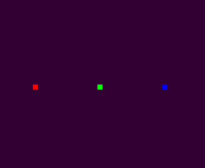
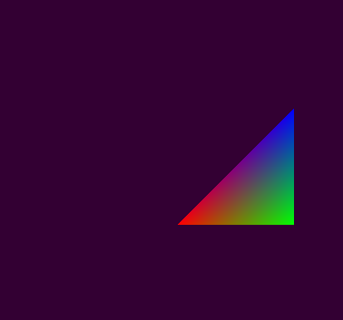

# SGLRenderer: A Simple, lightweight and easy-to-use OpenGL Renderer based on C++ language

This is a simple and lightweight OpenGL-based Renderer for my graphics research application. 
It wraps the GLSL-based Shader to allow quick 3D rendering demostration.
GLM(https://github.com/g-truc/glm) is used for matrix calculation.


## Features
+ Simple: No rendering algorithm is included. You must write yours.
+ All the GPU Buffers are allocated at their first usage in rendering.

## Usage
There are simple examples. I take freeglut as window system in my examples. To use SGLRenderer there are three main steps:
1. Writing your glsl-based shader
2. initialize Geometry and ShaderMaterial to create a 3D object
3. add the 3D object to a Scene.

You must combine the SGLRenderer code with your window system. I think the combination is easy, 
which only involves initialization and draw code block in Qt and freeglut.
## shader source text specification
You must name the vertex position attribute in vertex shader as position as the following code shows
```C++
in vec3 position;
```
Besides, projection matrix and model-view matrix must be named as projectionMatrix and modelviewMatrix respectively.
```C++
uniform mat4 projectionMatrix;
uniform mat4 modelviewMatrix;
```
Projection matrix and model-view matrix will be provided by camera, so you do not need to provide the values for ShaderMaterial.


# Example
The complete source code of following examples can be found in the example directory.
## Point Rendering
This demostrates rendering 3 colorful points. The shader source text is simple.
```C++
static const string vs = R"(
#version 130
in vec3 position;
in vec3 color;
uniform mat4 projectionMatrix, modelviewMatrix;
out vec3 u_color;
void main() {
    gl_Position = projectionMatrix * modelviewMatrix * vec4(position, 1.0);
    u_color = color;
}
)";
static const string fs = R"(
#version 130
in vec3 u_color;
void main(){
    gl_FragColor = vec4(u_color,1.0);
}
)";
```
Initialize the 3D object Point.
```C++
    Ptr<Point> points;
    {
        vec3 vertex[]={
                vec3(-0.5, 0, -100), vec3(0, 0, -100), vec3(0.5, 0, -100)
        };
        vec3 color[]={
                vec3(1,0,0), vec3(0,1,0), vec3(0,0,1)
        };
        Ptr<VertexBuffer> vbo = VertexBuffer::create(vertex, sizeof(vertex), sizeof(vec3));
        Ptr<VertexBuffer> cbo = VertexBuffer::create(color, sizeof(color), sizeof(vec3));
        Ptr<Geometry> geometry = Geometry::create();
        geometry->add_attribute("position", vbo);
        geometry->add_attribute("color", cbo);

        Ptr<Shader> shader = Shader::create(vs, fs);
        Ptr<ShaderMaterial> material = ShaderMaterial::create(shader);
        points = Point::create(geometry, material);
        points->set_size(10.f);
    }
```

Add points to a scene.
```C++
    scene = Scene::create();
    {
        scene->add(points);
    }
```

Create a perspective camera.
```C++
    camera = PerspectiveCamera::create();
    {
        camera->lookat(vec3(0,0,0),vec3(0,0,-1),vec3(0,1,0));
        camera->perspective(atan(1.0/100.0)*2.0, 1.0, 1.0, 1000.0);
    }
```
Render the scene.
```C++
    glClear(GL_DEPTH_BUFFER_BIT | GL_COLOR_BUFFER_BIT);

    scene->draw(camera.get());
```
Then you can see three colorful points on screen. Your points can be cicle dots. That depends on the GPU driver.




## Line Rendering
This example shows two colorful lines. The shader source text reads
```C++
static const string vs = R"(
#version 130
in vec3 position;
in vec3 color;
uniform mat4 projectionMatrix, modelviewMatrix;
out vec3 u_color;
void main() {
    gl_Position = projectionMatrix * modelviewMatrix * vec4(position, 1.0);
    u_color = color;
}
)";
static const string fs = R"(
#version 130
in vec3 u_color;
void main(){
    gl_FragColor = vec4(u_color,1.0);
}
)";
```

The initialization of 3D object Line has a routine similar to Point.

```C++
Ptr<Line> twoLines;
    {
        vec3 vertex[]={
                vec3(0., 0, -100), vec3(0.5, 0, -100), vec3(0.5, 0.5, -100)
        };
        vec3 color[]={
                vec3(1,0,0), vec3(0,1,0), vec3(0,0,1)
        };
        Ptr<VertexBuffer> vbo = VertexBuffer::create(vertex, sizeof(vertex), sizeof(vec3));
        Ptr<VertexBuffer> cbo = VertexBuffer::create(color, sizeof(color), sizeof(vec3));
        Ptr<Geometry> geometry = Geometry::create();
        geometry->add_attribute("position", vbo);
        geometry->add_attribute("color", cbo);

        Ptr<Shader> shader = Shader::create(vs, fs);
        Ptr<ShaderMaterial> material = ShaderMaterial::create(shader);
        twoLines = Line::create(geometry, material);
        twoLines->set_line_width(2.0f);
    }
```

 Add the line instances to a scene and set up a perspective camera.
 
```C++
     scene = Scene::create();
    {
        scene->add(twoLines);
    }

    camera = PerspectiveCamera::create();
    {
        camera->lookat(vec3(0,0,0),vec3(0,0,-1),vec3(0,1,0));
        camera->perspective(atan(1.0/100.0)*2.0, 1.0, 1.0, 1000.0);
    }
```

And render the scene

```C++
        scene->draw(camera.get());
```

Then we get two orthogonal lines


## Triangle

This example shows the usage of TriMesh. TriMesh is used to render triangles. The data of triangle can be stored as vertices or as vertices and indices.

Shader source:

```C++
static const string vs = R"(
#version 130
in vec3 position;
in vec3 color;
uniform mat4 projectionMatrix, modelviewMatrix;
out vec3 u_color;
void main() {
    gl_Position = projectionMatrix * modelviewMatrix * vec4(position, 1.0);
    u_color = color;
}
)";
static const string fs = R"(
#version 130
in vec3 u_color;
void main(){
    gl_FragColor = vec4(u_color,1.0);
}
)";
```

Initialization of TriMesh:

```C++
Ptr<TriMesh> triangle;
    {
        vec3 vertex[]={
                vec3(0., 0, -100), vec3(0.5, 0, -100), vec3(0.5, 0.5, -100)
        };
        vec3 color[]={
                vec3(1,0,0), vec3(0,1,0), vec3(0,0,1)
        };
        Ptr<VertexBuffer> vbo = VertexBuffer::create(vertex, sizeof(vertex), sizeof(vec3));
        Ptr<VertexBuffer> cbo = VertexBuffer::create(color, sizeof(color), sizeof(vec3));
        Ptr<Geometry> geometry = Geometry::create();
        geometry->add_attribute("position", vbo);
        geometry->add_attribute("color", cbo);

        Ptr<Shader> shader = Shader::create(vs, fs);
        Ptr<ShaderMaterial> material = ShaderMaterial::create(shader);
        triangle = TriMesh::create(geometry, material);
    }
```
Set up scene and camera:

```C++
    scene = Scene::create();
    {
        scene->add(triangle);
    }

    camera = PerspectiveCamera::create();
    {
        camera->lookat(vec3(0,0,0),vec3(0,0,-1),vec3(0,1,0));
        camera->perspective(atan(1.0/100.0)*2.0, 1.0, 1.0, 1000.0);
    }
```

And Render the scene:

```C++
scene->draw(camera.get());
```

The rendering result shows:


